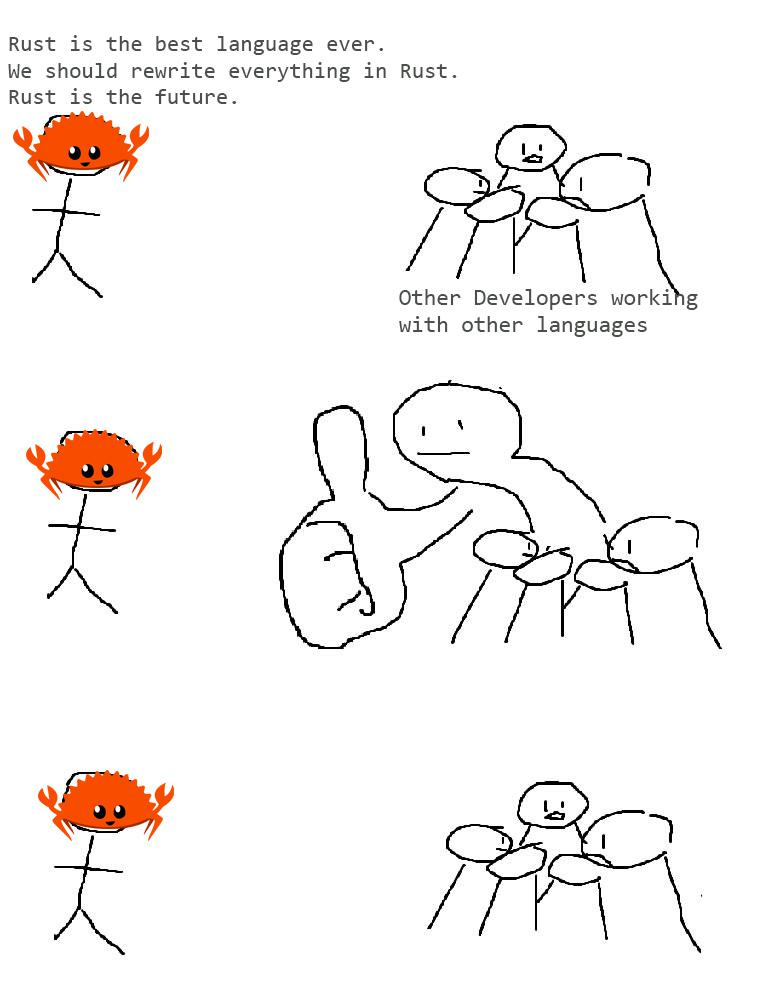
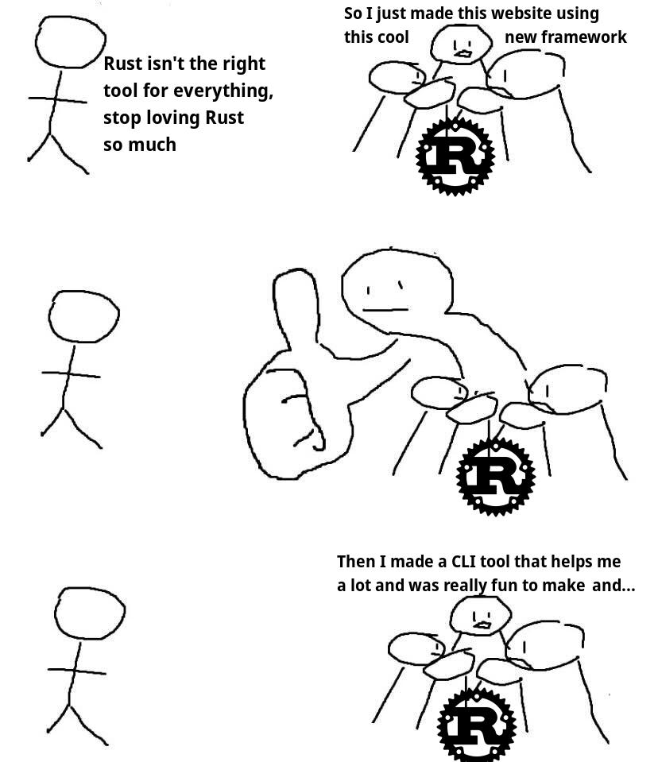
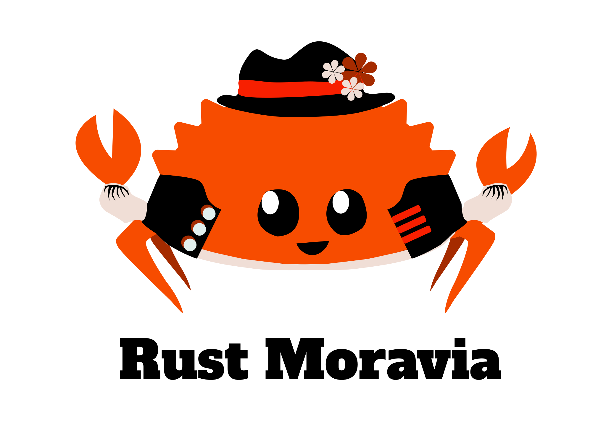
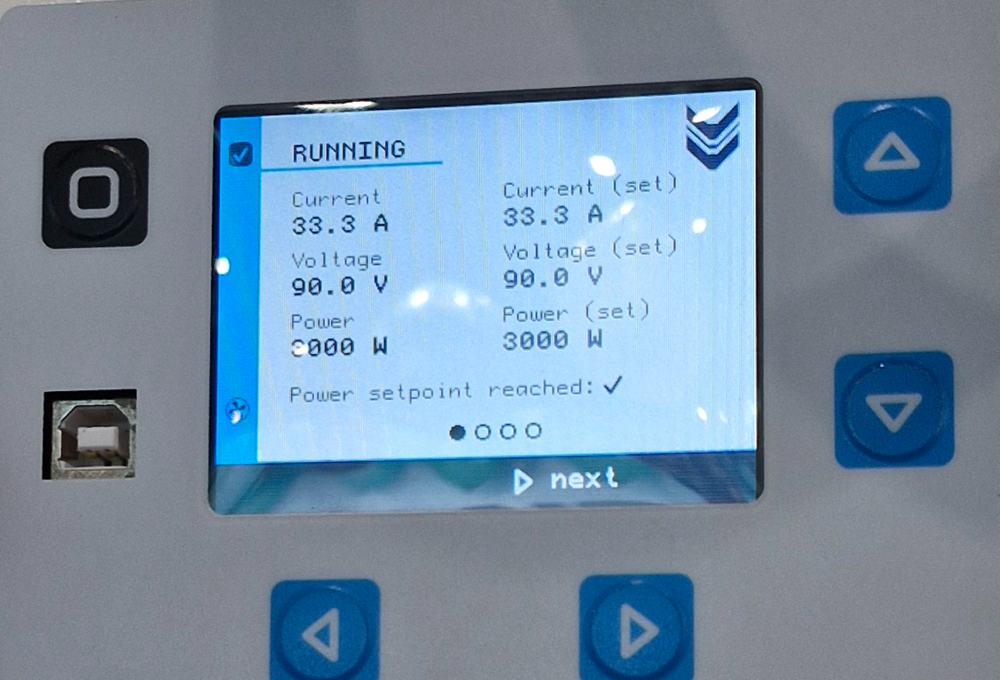
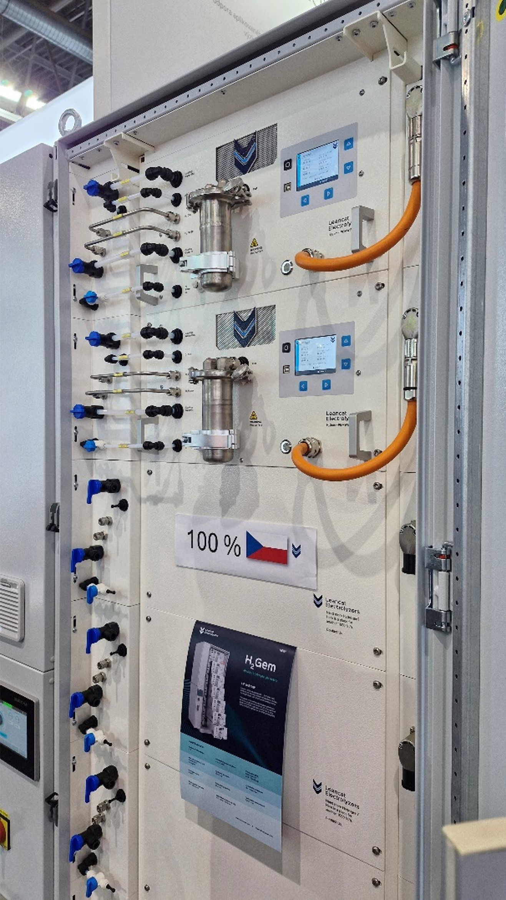
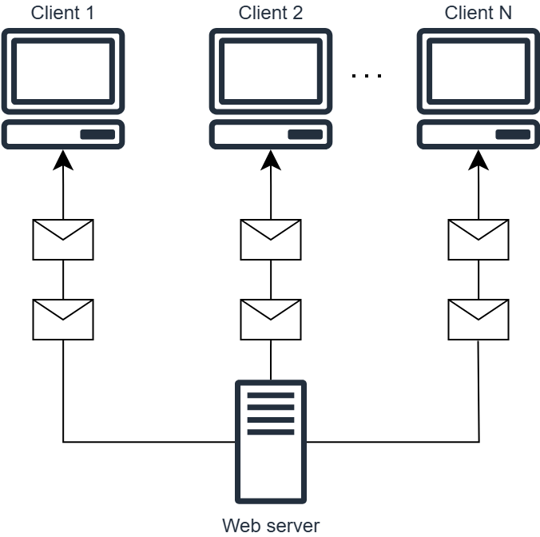
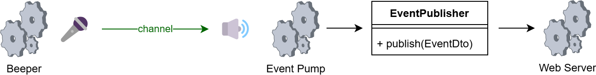
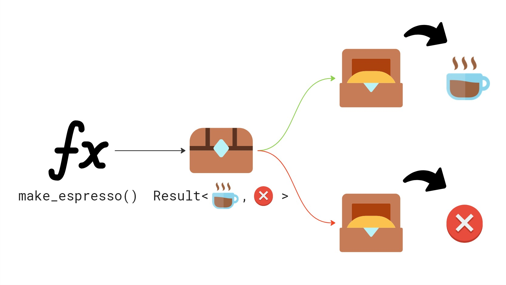

<style>
img[alt~="logo"] {
  position: absolute;
  top: 10px;
  right: 10px;
  width: 210px;
}

h1 {
    color: #009645
}

h2 {
    color: #009645
}

pre {
    background: #f8f8f8
}

img[alt~="rust-logo"] {
  position: absolute;
  top: 500px;
  right: 40px;
  width: 180px;
}
</style>


# Výhody Rustu, o kterých 'nikdo nemluví'


---




---


## Tato přednáška

Záměrně se vyhneme srovnání s jinými jazyky

Obejdeme nejčastěji skloňované přednosti = výkon a paměťovou bezpečnost

Zaměříme se na vybrané přednosti, o kterých 'nikdo nemluví'

1. Souběžnost bez obav (Fearless Concurrency)
2. Živý ekosystém a komunita
3. Silná makra and generiky
4. Práce s chybami

---

<!-- paginate: true -->

<!-- _footer: in/marek-psenka -->


## Marek Pšenka

<style>
img[alt~="moravia_qr"] {
  position: absolute;
  top: 450px;
  right: 160px;
  width: 200px
}
</style>

- Technický vedoucí v Edhouse
- 7 let zkušeností
- Většinu kariéry jsem pracoval s C++ a C#
- Rust používám již dva roky
- Založil jsem uživatelskou skupinu Rust Moravia




---

## Generátor vodíku H2Gem

- Zařízení pro výrobu zeleného vodíku
- Kolegové v Edhouse vyvinuli kompletní firmware
- Rust jim významně pomohl se spolehlivostí

<style>
img[alt~="leancat_logo"] {
  position: absolute;
  top: 30px;
  right: 30px;
  width: 250px
}
</style>






---

## H2Gem technicky

Řešené úlohy:

- komunikace a řízení zdroje elektrické energie
- komunikace se senzory a nadřazeným systémem
- zobrazení a vstupy na/z grafického displeje
- vše na platformě STM32.

Role Rustu:

- Celé řešení, včetně ovladačů pomocí RTIC
- žádné runtime chyby v průběhu vývoje a testování
- rychlejší obrátky na HW


---

<style>
img[alt~="qr"] {
  position: absolute;
  top: 240px;
  right: 500px;
  width: 250px
}
</style>


## 0. Demo příklad


---




## Server-sent Events (SSE)

```text
c:\code\rust-advantages>cargo run
    Finished `dev` profile [unoptimized + debuginfo] target(s) in 0.09s
     Running `target\debug\example-server.exe`
http://localhost:3000
```

```shell
client> curl -N http://localhost:3000/events 

event: beep
data: {"counter_value":7}

event: beep
data: {"counter_value":8}

...
```

---


## 1. Souběžnost bez obav (Fearless Concurrency)

---


## Co můžeme neohroženě (fearlessly) napsat jinde?

```pseudocode
function f(integer& n)
{
    ++n;
}

function main () {
    integer n = 0;
    thread my_thread(f, &n);
    my_thread.join();
    print(n);
}
```

---


## Rust potřebuje víc, aby zůstal v klidu (fear-less)

```rust
fn f(n_container: Arc<Mutex<i32>>) {
    let mut n_ref = n_container.lock().expect("Lock is not poisoned");
    *n_ref += 1;
}

fn main() {
    let n_container = Arc::new(Mutex::new(0i32));
    let container_clone = n_container.clone();
    let my_thread = std::thread::spawn(move || {
        f(container_clone);
    });
    _ = my_thread.join();
    let n_ref = n_container.lock().expect("Lock not poisoned");
    println!("{}", *n_ref);
}
```

---

## Producent a konzument


- Producent počítá a odesílá. Konzument přijímá a v mezičase dělá jinou práci.
- Potenciál urychlení v paralelním a souběžném prostředí.
- Typická implementace:
  - primitiva (_Mutexy_, _Condition Variables_, _Fronty_, etc.), souběžný přístup k paměti.
- Rust:
  - `channel` = `Sender` 🎤 a `Receiver` 🔊

---

## Můj příklad z pohledu procesů*




```rust
let publisher = Arc::new(DefaultEventPublisher::new());
let (sender, receiver) = channel(1000);
let beep_handle = spawn(send_beep(sender));
let pump_handle = spawn(pump_events(publisher, receiver));
let server_handle = spawn(run_server(state));

_ = try_join!(beep_handle, pump_handle, server_handle)?;
```

<!-- _footer: "* Termín proces zde označuje obecný asynchronní proces, nikoliv OS proces." -->
---


## Pípák

```rust
async fn send_beep(sender: Sender<u32>) -> Result<()> {
    let mut interval = interval(Duration::from_secs(1));
    let mut counter = 0u32;
    loop {
        interval.tick().await;
        counter += 1;
        sender.send(counter).await?
    }
}
```

---


## Pumpa

```rust
#[derive(Serialize)]
struct BeepEventData {
    counter_value: u32,
}

async fn pump_events(
    publisher: Arc<dyn EventPublisher + Send + Sync>,
    mut receiver: Receiver<u32>,
) -> Result<()> {
    loop {
        let counter_value = receiver.recv().await.ok_or(anyhow!("Channel closed"))?;
        let data = BeepEventData { counter_value };
        let dto = EventDto::with_json_payload("beep".to_string(), data)?;
        publisher.publish(dto);
    }
}
```

---


## 2. Silný ekosystém a komunita

---

## Tokio a Axum


<style>
img[alt~="tokio-logo"] {
  position: absolute;
  top: 390px;
  right: 140px;
  width: 250px
}
</style>

knihovny, v Rustu se říká _craty_ (angl. crate = bedna)

- `tokio` - asynchronní runtime a sada nástrojů pro stavbu asynchronního kódu
  - `spawn`, `broadcast::channel`, `time::interval`
- `axum` - webový aplikační framework
  - `Router`, `routing::get`, `response::sse`

S jejich pomocí mě __podpora SSE stála pouze 150 řádků__


---


## Implementace `EventPublisher`

```rust
pub struct DefaultEventPublisher {
    tx: Sender<EventDto>,
    _rx: Receiver<EventDto>,
}

impl EventPublisher for DefaultEventPublisher {
    fn get_stream(&self) -> BroadcastStream<EventDto> {
        BroadcastStream::from(self.tx.subscribe())
    }

    fn publish(&self, evt: EventDto) {
        self.tx
            .send(evt)
            .expect("Will not fail because we keep one Receiver instance");
    }
}
```

---


## Handler requestu `GET /events`

```rust
pub async fn get_events(
    State(state): State<Arc<ApiState>>,
) -> Sse<impl Stream<Item = Result<Event, BoxError>>> {
    let stream = state.be_publisher.get_stream().map(|maybe_evt| {
        maybe_evt
            .map(|evt| Event::default().event(evt.name).data(evt.payload))
            .map_err(|err| err.into())
    });

    Sse::new(stream).keep_alive(KeepAlive::default())
}

```

---


## Cargo

<style>
img[alt~="cargo-logo"] {
  position: absolute;
  top: 200px;
  right: 250px;
  width: 400px
}
</style>

_Package manager_, sjednocuje způsob:

- popisu artefaktů - `Cargo.toml`
- sestavení - `cargo build`
- publikace - `cargo publish`
- __testování__ - `cargo test`
- __dokumentace__ - `cargo doc`
- atd.


---


## 3. Silná makra a generiky

---


## Generická funkce s trait bound

Serializace do JSON, legendární `serde` v akci

```rust
pub struct EventDto {
    pub name: String,
    pub payload: String, // <-- JSON goes here!, e.g. {"counter_value":7}
}

impl EventDto {
    pub fn with_json_payload<T: serde::Serialize>(name: String, payload: T)
    ) -> serde_json::Result<EventDto> {
        Ok(EventDto {
            name,
            payload: serde_json::to_string(&payload)?,
        })
    }
}
```

---


## Implementace trait pomocí procedurálního makra

```rust
#[derive(Serialize)]
struct BeepEventData {
    counter_value: u32,
}
```

Procedurální makro prochází příslušný stream tokenů a transformuje jej.

Makro `Serialize` generuje implementaci traitu `serde::Serialize` čistě z definice struktury.

Eliminace boilerplate, děje se za překladu bez runtime overhead.

---


## 4. Práce s chybami

---


```rust
pub struct CoffeeMachine {
    water_tank_volume: f64,
    available_coffee_beans: f64,
}

impl CoffeeMachine {
    pub fn make_espresso(&self) -> Result<Espresso, String> {
        if self.water_tank_volume < 25.0 {
            Err("Not enough water in tank".to_string())
        } else if self.available_coffee_beans < 7.0 {
            Err("Not enough coffee beans".to_string())
        } else {
            Ok(Espresso {})
        }
    }
}
```

---


```rust
    #[test]
    fn error_returned_when_making_espresso_without_beans() {
        let machine = CoffeeMachine {
            water_tank_volume: 300.0,
            available_coffee_beans: 2.0,
        };

        let result = machine.make_espresso();
        assert!(result.is_err());
        assert_eq!(result, Err("Not enough coffee beans".to_string()));
    }
```

---



---


## Filozofie

- Myšlenka vyhradit prostor pro chybové informace v návratové hodnotě není nová

- Rust ji významně rozpracoval

- Jiná strategie - výjimky
  - nejsou vidět, jsou implicitní (čest výjimkám 🙂)
  - řešit vyjímky je opt-in a přitom můžou shodit celý program

- Errory
  - jsou vidět, jsou explicitní
  - neřešit error je opt-out, programátor musí explicitně říct, že ho nechce řešit

---


## Outro

---

<style>
img[alt~="linkedin-qr"] {
  position: absolute;
  top: 450px;
  right: 200px;
  width: 220px
}
</style>


## Shrnutí

- O Rustu se toho hodně namluví
- Jeden extrém tvrdí, že se má vše přepsat do Rustu
- Druhý extrém zase, že Rust patří jen tam, kde je potřebný výkon a bezpečnost
- Pokud hledáte no-bullshit pohled na Rust, klidně se na mě obraťte
- Rust má mnoho předností, o kterých 'se nemluví', vybral jsem pro vás:
  1. Souběžnost bez obav (Fearless Concurrency)
  2. Živý ekosystém a komunitu
  3. Silná makra and generiky
  4. Práci s chybami


