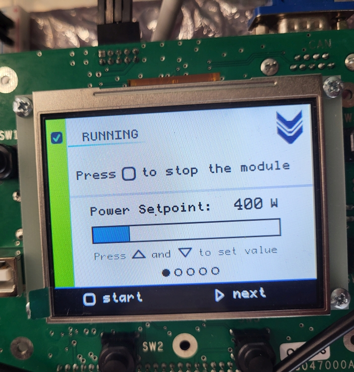

<style>
img[alt~="logo"] {
  position: absolute;
  top: 30px;
  right: 30px;
  width: 210px;
}

h1 {
    color: #009645
}

h2 {
    color: #009645
}

pre {
    background: #f8f8f8
}

img[alt~="rust-logo"] {
  position: absolute;
  top: 500px;
  right: 40px;
  width: 180px;
}
</style>


# Výhody Rustu, o kterých 'nikdo nemluví'


---


---


## Tato přednáška

<style>
img[alt~="qr"] {
  position: absolute;
  top: 360px;
  right: 140px;
  width: 250px
}
</style>

Záměrně se vyhneme srovnání s jinými jazyky

Obejdeme nejčastěji skloňované přednosti = výkon a paměťovou bezpečnost

Zaměříme se na přednosti, o kterých 'nikdo nemluví'

- Souběžnost bez obav (Fearless Concurrency)
- Živý ekosystém a komunita
- Silná makra and generiky
- Práce s chybami


---

<!-- paginate: true -->

<!-- _footer: in/marek-psenka -->


## Marek Pšenka

- Technický vedoucí v Edhouse
- 7 let zkušeností
- Většinu kariéry jsem pracoval s C++ a C#
- Rust používám již dva roky

---

## Generátor vodíku H2Gem

- Zařízení pro výrobu zeleného vodíku
- Kolegové v Edhouse vyvinuli kompletní firmware
- Rust jim významně pomohl se spolehlivostí

<style>
img[alt~="leancat_logo"] {
  position: absolute;
  top: 30px;
  right: 30px;
  width: 250px
}
</style>


---

## H2Gem technicky

Řešené úlohy:

- komunikace a řízení zdroje elektrické energie
- komunikace se senzory a nadřazeným systémem
- zobrazení a vstupy na/z grafického displeje
- vše na platformě STM32.

Role Rustu:

- Celé řešení, včetně ovladačů pomocí RTIC
- žádné runtime chyby v průběhu vývoje a testování
- rychlejší obrátky na HW




---


## Server-sent Events (SSE)

```text
c:\code\rust-advantages>cargo run
    Finished `dev` profile [unoptimized + debuginfo] target(s) in 0.09s
     Running `target\debug\example-server.exe`
http://localhost:3000
```

```shell
client> curl -N http://localhost:3000/events 

event: beep
data: {"counter_value":7}

event: beep
data: {"counter_value":8}

...
```

---

## Souběžnost bez obav (Fearless Concurrency)

---


## Co můžeme neohroženě (fearlessly) napsat jinde?

```pseudocode
function f(integer& n)
{
    ++n;
}

function main () {
    integer n = 0;
    thread my_thread(f, &n);
    my_thread.join();
    print(n);
}
```

---


## Rust potřebuje víc, aby zůstal v klidu (fear-less)

```rust
fn f(n_container: Arc<Mutex<i32>>) {
    let mut n = n_container.lock().expect("Lock is not poisoned");
    *n += 1;
}

fn main() {
    let n_container = Arc::new(Mutex::new(0i32));
    let container_clone = n_container.clone();
    let my_thread = std::thread::spawn(move || {
        f(container_clone);
    });
    _ = my_thread.join();
    let n = n_container.lock().expect("Lock not poisoned");
    println!("{}", *n);
}
```

---

## Producent a konzument


- Producent počítá a odesílá. Konzument přijímá a v mezičase dělá jinou práci.
- Potenciál urychlení v paralelním a souběžném prostředí.
- Typická implementace:
  - primitiva (_Mutexy_, _Condition Variables_, _Fronty_, etc.), nad sdílenou pamětí.
- Rust:
  - `channel` = `Sender` 🎤 a `Receiver` 🔊

---

## Můj příklad z pohledu procesů*


```rust
let publisher = Arc::new(DefaultEventPublisher::new());
let (sender, receiver) = channel(1000);
let beep_handle = spawn(send_beep(sender));
let pump_handle = spawn(pump_events(publisher, receiver));
let server_handle = spawn(run_server(state));

_ = try_join!(beep_handle, pump_handle, server_handle)?;
```

<!-- _footer: "* Termín proces je použit ve smyslu obecného asynchronního procesu, nikoliv OS procesu" -->
---


```rust
pub struct CoffeeMachine {
    water_tank_volume: f64,
    available_coffee_beans: f64,
}

impl CoffeeMachine {
    pub fn make_espresso(&self) -> Result<Espresso, String> {
        if self.water_tank_volume < 25.0 {
            Err("Not enough water in tank".to_string())
        } else if self.available_coffee_beans < 7.0 {
            Err("Not enough coffee beans".to_string())
        } else {
            Ok(Espresso {})
        }
    }
}
```

---


```rust
    #[test]
    fn error_returned_when_making_espresso_without_beans() {
        let machine = CoffeeMachine {
            water_tank_volume: 300.0,
            available_coffee_beans: 2.0,
        };

        let result = machine.make_espresso();
        assert!(result.is_err());
        assert_eq!(result, Err("Not enough coffee beans".to_string()));
    }
```

---


---


## Filozofie

Myšlenka vyhradit prostor pro chybové informace v návratové hodnotě není nová

```C
int main(void)
{
    FILE *f = fopen("non_existent", "r");
    if (f == NULL) {
        perror("fopen() failed");
    } else {
        fclose(f);
    }
}
```

```text
fopen() failed: No such file or directory
```

---


## Rust nám to usnadňuje

```rust
pub enum Result<T, E> {
    Ok(T),
    Err(E),
}
```

```rust
fn open_nonexistent_file() {
    match std::fs::File::open("non_existent") {
        Ok(file) => drop(file),
        Err(err) => println!("open() failed: {}", err),
    }
}
```

```text
open() failed: The system cannot find the file specified. (os error 2)
```

---


## Porovnej

```C
int main(void) {
    FILE *f = fopen("non_existent", "r");
    if (f == NULL) {
        perror("fopen() failed");
    } else {
        fclose(f);
    }
}
```

```rust
fn open_nonexistent_file() {
    match std::fs::File::open("non_existent") {
        Ok(file) => drop(file),
        Err(err) => println!("open() failed: {}", err),
    }
}
```

---

## Jiná strategie - výjimky v C\# - nejsou vidět


```C#
public static System.IO.FileStream Open (string path, System.IO.FileMode mode);
```

Kde se dozvím jak vypadá chyba? __V dokumentaci__:
> ArgumentNullException
> PathTooLongException
> (...)

Rust je explicitní. Dozvím se to __v kódu__:

```rust
pub fn open<P: AsRef<Path>>(path: P) -> std::Result<T, std::io::Error>;
```

---

## Vyjímky střílí


```C#
void OpenNonexistentFile() {
    File.Open("non_existent", FileMode.Open);
}

OpenNonexistentFile();

DoSomethingElse();
```

```text
C:\code\rust-error-handling\_examples_cs>dotnet run
Unhandled exception. System.IO.FileNotFoundException: Could not find file 'non_existent'.
(...)
```

---

## Porovnej


```C#
void OpenNonexistentFile() {
    try 
    {
        File.Open("non_existent", FileMode.Open);
    }
    catch (Exception e) {
        Console.WriteLine($"{e}");
    }
}
```

```rust
fn open_nonexistent_file() {
    match std::fs::File::open("non_existent") {
        Ok(file) => drop(file),
        Err(err) => println!("open() failed: {}", err),
    }
}
```

---


## Shrnutí

- Rust nám na zákaznických projektech pomáhá psát spolehlivý kód
- Myšlenka vyhradit prostor pro chybové informace v návratové hodnotě není nová
- Rust nám to usnadňuje standardním typem `Result<T, E>`
- Příklad alternativní strategie jsou výjimky.
- Nejsou ale vidět a střílí - nutná bdělost

---

<!-- _footer: "" -->
<!-- paginate: false -->


